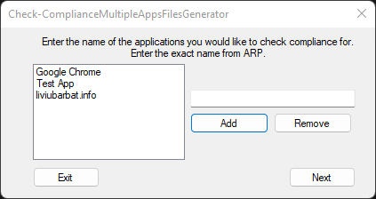

# Custome Compliance Policy Generator GUI


## Overview
The **CustomeCompliancePolicyGeneratorGUI** is a **GUI-based tool** designed to simplify the creation of **Intune compliance detection scripts** for multiple applications. This tool allows IT administrators to easily define compliance rules for **application presence or version requirements**, ensuring compliance with corporate policies.

The generator produces **PowerShell scripts and JSON configuration files** that can be used as **custom compliance policies in Microsoft Intune**. This eliminates the need for manual script writing and ensures consistency across managed devices.

---

## **Screenshot**


---

## Features
✔️ **Easy-to-use GUI** for generating compliance detection files.  
✔️ **Supports multiple applications** in a single compliance policy.  
✔️ **Two compliance check modes**:
   - **Application Presence** (Detect if an app is installed).  
   - **Application Version** (Verify if an app meets a minimum version requirement).  
✔️ **Allows choosing between user-based (HKCU) and machine-wide (HKLM) installations**.  
✔️ **Automatically generates PowerShell & JSON files for Intune deployment**.  
✔️ **Creates a ZIP archive** with all necessary files for easy distribution.  

---

## Installation & Usage

### 1. Download & Run
- Download **CustomeCompliancePolicyGeneratorGUI.exe**.
- Run the **.exe** file (**No installation required**).

### 2. Select Applications for Compliance Check
- Enter the **exact application names** as they appear in `Add or Remove Programs`.
- Click **Add** to insert applications into the list.
- Click **Remove** to delete applications from the list.
- Click **Next** to proceed.


---

### 3. Choose Compliance Type
- **Check app presence** → Ensures an app is **not installed**.  
- **Check app version** → Ensures an app meets a **minimum version requirement**.  
- Choose **HKCU (user-based install)** or **HKLM (machine-wide install)** based on the app’s installation method.
- Click **Next** to continue.


---

### 4. Enter Minimum Version (If Selected)
If you selected **Check app version**, you will be prompted to enter the **minimum required version** for each application.


- Enter the required version numbers.
- Click **OK** to proceed.

---

### 5. Save the Generated Files
- After setting up the compliance rules, the tool will generate:
  - **PowerShell detection script** (`Check-ComplianceMultipleApps.ps1`).
  - **JSON configuration file** (`Check-ComplianceMultipleApps.json`).
- You will be prompted to **save the files as a ZIP archive** for easy deployment.

---

## Example Output

### 🔹 **Generated PowerShell Script**
Example **Check-ComplianceMultipleApps.ps1**:
```powershell
$AppNames = @("Google Chrome", "Zoom", "Microsoft Edge")
$foundApps = @()

foreach ($app in $AppNames) {
    $installed = Get-ItemProperty -Path "HKLM:\Software\Microsoft\Windows\CurrentVersion\Uninstall\*" -ErrorAction SilentlyContinue |
                 Where-Object { $_.DisplayName -match $app }

    if ($installed) {
        $foundApps += $app
    }
}

if ($foundApps.Count -gt 0) {
    Write-Host "Non-compliant: $($foundApps -join ', ') found."
    exit 1
} else {
    Write-Host "Compliant: No unauthorized applications detected."
    exit 0
}
```

### 🔹 **Generated JSON Compliance Rule**
Example **Check-ComplianceMultipleApps.json**:
```json
{
    "Rules":  [
        {
            "SettingName":  "Google Chrome",
            "Operator":  "GreaterEquals",
            "DataType":  "Version",
            "Operand":  "133.0.6943.54",
            "MoreInfoUrl":  "https://www.google.com/chrome/",
            "RemediationStrings":  [
                {
                    "Language":  "en_US",
                    "Title":  "Google Chrome is outdated or not installed.",
                    "Description":  "Please install or update Google Chrome."
                }
            ]
        }
    ]
}
```

---

## Deployment in Intune
To enforce compliance policies in **Microsoft Intune**, follow these steps:

1. **Upload `Check-App-Presence.ps1`** as a detection script in Intune.
2. **Upload `Check-App-Presence.json`** as the compliance policy rule.
3. Assign the compliance policy to the **targeted device groups**.
4. Monitor compliance results in **Microsoft Endpoint Manager (Intune)**.

---

## Use Cases
- **Block unauthorized software** (e.g., Google Chrome, TeamViewer, Zoom).  
- **Ensure critical applications are installed and enforced** (e.g., Antivirus, Security tools).  
- **Automate compliance enforcement** with pre-defined rules.  

---

## References
- [Microsoft Intune Custom Compliance Policies](https://learn.microsoft.com/en-us/mem/intune/protect/device-compliance-get-started)

---

## Notes
- This tool is designed for **Microsoft Intune Custom Compliance Policies**.  
- Modify only the **application names and versions** as needed.  
- **Test before deployment** to avoid unintended compliance failures.  

---

## License 
This project is licensed under the [MIT License](https://opensource.org/licenses/MIT).

---

**Disclaimer:** This tool and scripts are provided as-is. Test them in a staging environment before deployment. The author is not responsible for any unintended consequences.
